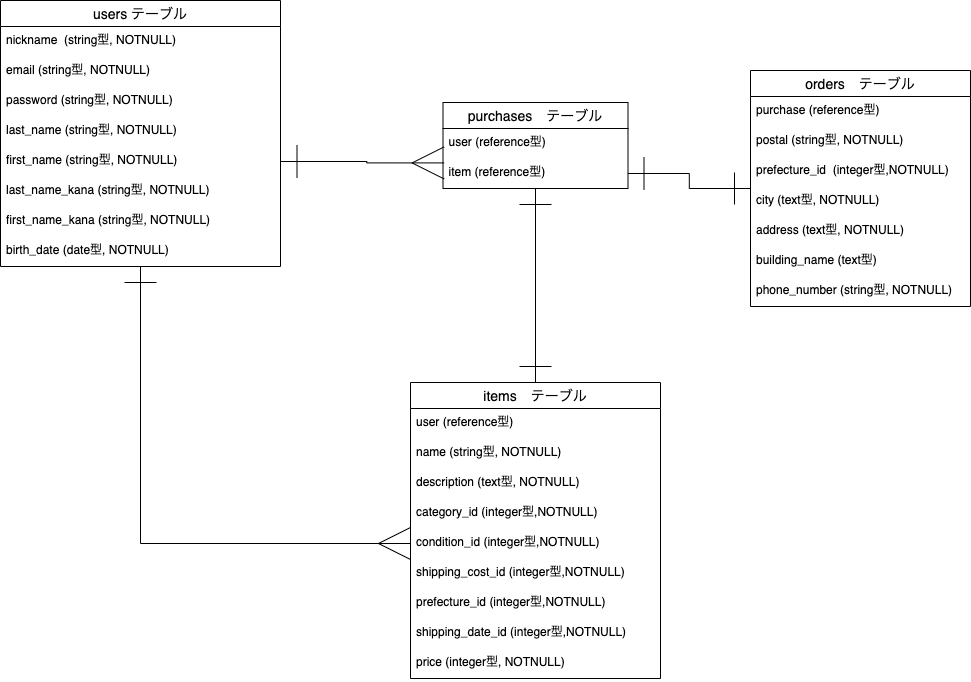

# テーブル構成

## users テーブル

| Column          | Type   | Options     |
| --------------- | ------ | ----------- |
| nickname        | string | null: false |
| email           | string | null: false |
| password        | string | null: false |
| last-name       | string | null: false |
| first-name      | string | null: false |
| last-name-kana  | string | null: false |
| first-name-kana | string | null: false |
| birth-date      | date   | null: false |

### Association

- has_many :items
- has_many :purchases

## items テーブル

| Column        | Type                 | Options                        |
| ------------- | -------------------- | ------------------------------ |
| user          | references           | null: false, foreign_key: true |
| image         | ActiveStorage で実装 |
| item-name     | text                 | null: false                    |
| description   | text                 | null: false                    |
| category      | ActiveHash で実装    |
| condition     | ActiveHash で実装    |
| shipping-cost | ActiveHash で実装    |
| prefecture    | ActiveHash で実装    |
| shipping-date | ActiveHash で実装    |
| price         | integer              | null: false                    |

### Association

- belongs_to :user
- has_one :purchases

## orders テーブル

| Column        | Type              | Options     |
| ------------- | ----------------- | ----------- |
| postal        | string            | null: false |
| prefecture    | ActiveHash で実装 |
| city          | text              | null: false |
| address       | text              | null: false |
| building-name | text              |             |
| phone-number  | string            | null: false |

### Association

- has_one :purchases

## purchases 　テーブル

| Column | Type       | Options                        |
| ------ | ---------- | ------------------------------ |
| user   | references | null: false, foreign_key: true |
| item   | integer    | null: false                    |
| order  | integer    | null: false                    |

### Association

- belongs_to :user
- belongs_to :item
- belongs_to :order

# furima-32495 の ER 図

